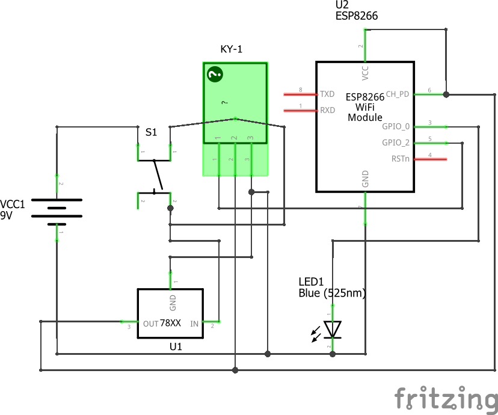
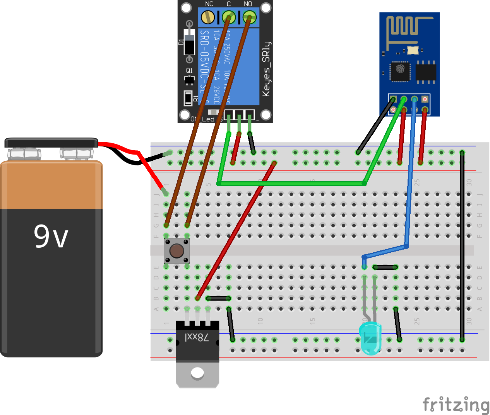

# Doorbell-Transmitter
A doorbell transmitter using ESP8266
This is the transmitter portion of a doorbell system using ESP8266. The receiver repo is at [github.com/ameer1234567890/Doorbell-Receiver](https://github.com/ameer1234567890/Doorbell-Receiver)

#### Schematic

#### Breadboard Layout
* This is how I have setup ArduinoClock on a breadboard.

#### Pictures
* https://www.instagram.com/p/BzX7ntXgXLL/
